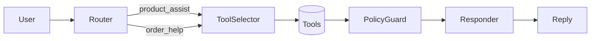

# AI Commerce Agent

LangGraph implementation for product assistance and order management with policy enforcement.

## Overview

This agent provides:
- Product search and recommendations
- Secure order lookup and cancellation
- Strict 60-minute cancellation policy
- Structured JSON traces for all interactions

## Core Features

### Product Assist Flow
- Search products with price cap and tags
- Provide M/L size guidance
- Calculate delivery ETA by zip code

### Order Management Flow
- Secure lookup with order_id + email
- 60-minute cancellation window
- Alternative options when cancellation blocked

## Quick Setup

```bash
# Clone repository
git clone https://github.com/MaheswarreddyPalugulla/Langgraph-ai-Commerce-Agent.git
cd Langgraph-ai-Commerce-Agent

# Create and activate virtual environment
python -m venv venv
.\venv\Scripts\activate  # Windows
source venv/bin/activate # Unix

# Install dependencies
pip install -r requirements.txt

# Configure environment
cp .env.example .env
```

Copy all the provided files to their respective locations:

```
ai-commerce-agent/
├── src/
│   ├── graph.py           # Main LangGraph workflow
│   └── tools.py           # Business logic tools
├── data/
│   ├── products.json      # Product catalog
│   └── orders.json        # Order database
├── prompts/
│   └── system.md          # Agent instructions  
├── tests/
│   └── run_tests.py       # Test runner
├── requirements.txt       # Dependencies
├── .env.example           # Environment template
└── README.md              # This file
```

### 3. Configure Environment

```bash
# Copy environment template
cp .env.example .env

# The default configuration uses Mock LLM (recommended)
# No additional setup needed!
```

### 4. Run Tests

```bash
python -m tests.run_tests
```

You should see output for all 4 test cases with JSON traces and final replies.

## Project Structure

```
├── src/
│   ├── graph.py
│   └── tools.py
├── data/
│   ├── products.json
│   └── orders.json
├── prompts/
│   └── system.md
├── tests/
│   └── run_tests.py
├── requirements.txt
└── readme.md
```

## LangGraph Implementation

5-node workflow for intelligent decision making:




### Node Functions
- **Router**: Intent classification (product_assist/order_help/other)
- **ToolSelector**: Tool selection based on intent
- **Tools**: Business logic execution
- **PolicyGuard**: 60-minute rule enforcement
- **Responder**: JSON trace + user response generation

## Testing

Run the test suite:
```bash
# Run all test scenarios
python -m tests.run_tests

# Run policy edge cases
python -m tests.test_policy
```

### Test Scenarios
1. **Product Assistance**
   - Search with price cap
   - Size recommendations
   - ETA calculation

2. **Order Cancellation (Allowed)**
   - Within 60-minute window
   - Email verification
   - Success confirmation

3. **Order Cancellation (Blocked)**
   - Beyond 60-minute window
   - Policy explanation
   - Alternative options

4. **Guardrail Behavior**
   - Invalid request handling
   - Legitimate alternatives

## JSON Traces

Every response includes structured output:
```json
{
  "intent": "product_assist|order_help|other",
  "tools_called": ["product_search", "size_recommender", "eta"],
  "evidence": [{
    "id": "P1",
    "title": "Example Dress",
    "price": 119,
    "sizes": ["S", "M", "L"]
  }],
  "policy_decision": {
    "cancel_allowed": false,
    "reason": "policy_violation",
    "alternatives": ["Update address", "Store credit"]
  },
  "final_message": "User-friendly response..."
}
```

## ⚙️ Configuration Options

### LLM Providers (choose in `.env`)

```bash
# Mock LLM (Recommended - deterministic, no setup)
LLM_PROVIDER=mock

# OpenAI (requires API key)
LLM_PROVIDER=openai
OPENAI_API_KEY=your_key_here

# Ollama (requires local installation)  
LLM_PROVIDER=ollama
OLLAMA_MODEL=llama3.1:8b
```

### Time Configuration
```bash
# For testing with different current times
CURRENT_TIME=2025-09-08T11:05:00Z
```

## 🔍 Development

### Run Individual Components

```bash
# Test tools directly
python -c "from src.tools import commerce_tools; print(commerce_tools.product_search('midi', 120, ['wedding']))"

# Test specific agent flow
python -c "from src.graph import run_agent; print(run_agent('Show me dresses under $100'))"

# Validate JSON trace format
python -c "from src.graph import run_agent; import json; result = run_agent('test'); print(json.dumps(result['trace'], indent=2))"
```

### Policy Testing

```bash
# Test 60-minute policy edge cases
python -c "
from src.tools import commerce_tools
result = commerce_tools.order_cancel('A1003', 'mira@example.com', '2025-09-07T12:30:00Z')  # 35 min
print('Within window:', result['success'])
result = commerce_tools.order_cancel('A1003', 'mira@example.com', '2025-09-07T13:30:00Z')  # 95 min  
print('Beyond window:', result['success'])
"
```

## 📊 JSON Trace Format

Every response includes a structured trace:

```json
{
  "intent": "product_assist|order_help|other",
  "tools_called": ["product_search", "size_recommender", "eta"],
  "evidence": [
    {
      "id": "P1",
      "title": "Midi Wrap Dress", 
      "price": 119,
      "sizes": ["S", "M", "L"],
      "color": "Charcoal"
    }
  ],
  "policy_decision": {
    "cancel_allowed": false,
    "reason": "policy_violation",
    "alternatives": ["Update shipping address", "Convert to store credit"]
  },
  "final_message": "Response text..."
}
```

## 🎯 Key Success Factors

✅ **Deterministic**: Mock LLM ensures consistent test results  
✅ **Policy Compliant**: 60-minute rule mathematically enforced  
✅ **No Hallucinations**: Only uses data from JSON files  
✅ **Complete Traces**: Every response has structured JSON  
✅ **Edge Case Handling**: Graceful error handling throughout  
✅ **Easy Setup**: Works immediately with Mock LLM


## Implementation Details

### Design Decisions
- Uses Mock LLM for consistent testing
- File-based storage with JSON
- UTC timestamps for time calculations
- Strict input validation

### Error Handling
- Invalid order IDs
- Missing email verification
- Non-existent products
- Exceeded price caps
- Policy violations